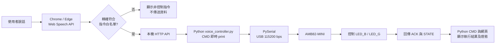

# Ameba Mini 語音控制 LED

本專案以瀏覽器進行語音辨識，再由 Python 主程式接收白名單指令、經 USB 序列埠控制 AMB82-MINI。Python 會在 CMD 即時印出辨識文字、傳送指令、板卡 `ACK/STATE` 與錯誤，網頁也會依板卡回覆更新 LED 狀態。

## 硬體基準

- 板卡：Realtek AmebaPro2 AMB82-MINI（RTL8735B）
- 藍色板載 LED：`LED_B`，Arduino 腳位 D23
- 綠色板載 LED：`LED_G`，Arduino 腳位 D24
- 控制邏輯：`HIGH` 亮、`LOW` 滅
- 序列埠：115200 bps

以上腳位已和本機安裝的 `realtek:AmebaPro2 4.1.1-build20260915` 板卡定義及官方範例核對。正式繳交前仍須以手上的實體板卡完成燈號測試。

## 系統架構



## 支援指令

| 語音 | 序列指令 | 動作 |
|---|---|---|
| 左邊開燈 | `LEFT_ON` | 開啟藍燈 |
| 左邊關燈 | `LEFT_OFF` | 關閉藍燈 |
| 右邊開燈 | `RIGHT_ON` | 開啟綠燈 |
| 右邊關燈 | `RIGHT_OFF` | 關閉綠燈 |
| 全部開燈 | `ALL_ON` | 兩燈皆亮 |
| 全部關燈 | `ALL_OFF` | 兩燈皆滅 |
| 閃爍三次 | `BLINK_3` | 兩燈閃爍三次後恢復原狀 |

英文模式建議使用容易發音的短指令：`Blue on/off`、`Green on/off`、`Lights on/off`、`Blink now`。舊版的 `left/right light on/off` 與 `Blink three` 仍保留相容性。

網站的「語音回覆」預設開啟。板卡 ACK 成功後，Python 會呼叫 Windows 內建語音由電腦喇叭播報執行結果；播報期間會暫停語音辨識，完成後自動恢復，避免系統把自己的回覆當成新指令。

## 使用方法

1. 在 Arduino IDE 選擇 `AmebaPro2 ARM (32-bits) Boards > AMB82-MINI`。
2. 開啟 [VoiceLedController.ino](firmware/VoiceLedController/VoiceLedController.ino)，編譯並上傳。
3. 上傳完成後按一次板上的 RESET，並關閉 Arduino 序列監控視窗，避免它占用 COM 埠。
4. 第一次使用時，在 CMD 安裝 Python 序列埠套件：

   ```powershell
   python -m pip install -r requirements.txt
   ```

5. 雙擊專案根目錄的 `start_voice_controller.cmd`。請保持 CMD 視窗開啟，它會由 Python 直接連接 COM3，並即時顯示語音辨識、序列指令、板卡回覆與錯誤事件。

   也可直接在 CMD 執行：

   ```powershell
   python -u voice_controller.py --serial-port COM3 --web-port 8000
   ```

6. 用最新版 Chrome 或 Edge 開啟 `http://localhost:8000/web/`。
7. 畫面顯示「COM3 已由 Python 連接」後，按「開始語音辨識」。如果尚未連接，可按「連接 AMB82-MINI」讓 Python 重試。

Python 是唯一會開啟 COM3 的控制程式。啟動前必須關閉 Arduino IDE 的序列監控及其他串口工具，否則 Python 會在 CMD 顯示「無法開啟 COM3」。關閉 CMD 視窗會停止 Python、釋放 COM3 及停止網頁伺服器，但不會主動改變 LED 狀態。

瀏覽器首次使用時會要求麥克風權限。語音辨識需瀏覽器支援；若語音辨識不可用，仍可用頁面上的測試按鈕驗證 Python、序列通訊與 LED。

## 異常處理

- 辨識結果不在白名單：網頁只顯示「非控制指令」，不傳送任何資料。
- 未連接或序列埠中斷：網頁顯示通訊失敗，不把畫面燈號改成成功狀態。
- 板卡收到未知指令：回傳 `ERR UNKNOWN_COMMAND`，LED 狀態不變。
- Python 送出指令後 4 秒未收到板卡 `ACK`：CMD 與網頁顯示逾時。
- COM3 被 Arduino 序列監控占用：Python 顯示明確錯誤，不啟動假連線。
- 畫面中的藍燈、綠燈狀態只由板卡回傳的 `STATE` 更新。

## 驗收紀錄

請使用 [acceptance-test.csv](docs/acceptance-test.csv) 記錄「左邊開燈」與「右邊開燈」各五次、非控制語句一次、通訊中斷一次。尚未接上實體板卡前，不要填入成功結果。

## 測試

指令白名單的自動測試：

```powershell
python -m unittest tests.test_voice_controller -v
node --test tests/command-parser.test.mjs
```

自動測試驗證 Python 的 `ACK/STATE` 協定處理、未知指令拒絕，以及瀏覽器文字正規化與指令映射；LED 實際亮滅、序列埠中斷與麥克風辨識仍需實機驗證。

## 繳交前清單

- [ ] 實機確認板卡標示為 AMB82-MINI
- [ ] 實機確認藍燈 D23、綠燈 D24 及 HIGH/LOW 邏輯
- [ ] 完成 12 項驗收並填寫 CSV
- [ ] 把實際問題與 AI 協作修正過程補到 `docs/vibe-coding-log.md`
- [ ] 錄製示範影片並上傳 YouTube
- [ ] 建立 GitHub 專案並填入連結
- [ ] 將 YouTube、GitHub 連結與架構圖放進最終 PDF
